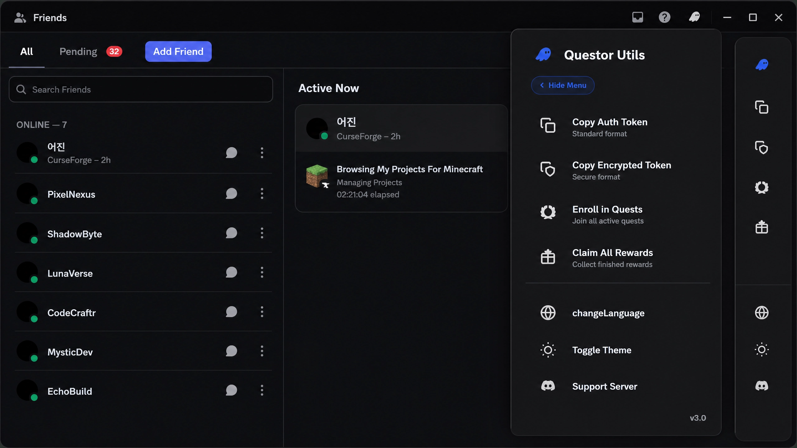
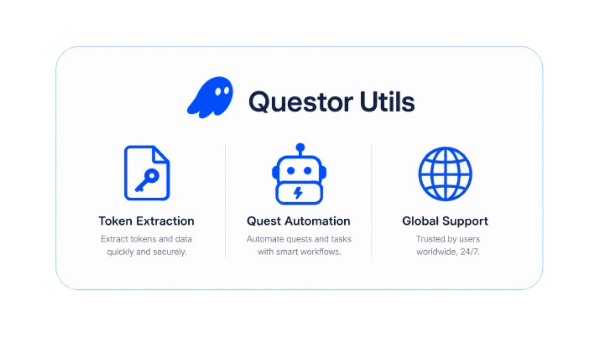

#  Questor Utils

**Questor Utils** is a powerful, high-performance userscript designed to enhance your Discord experience with advanced automation, security tools, and utility features. Built with a sleek, modern glassmorphism UI and featuring our signature ghost branding, it integrates seamlessly into the Discord interface to provide a premium, native feel.

---

## 🚀 Key Features

Questor Utils comes packed with a suite of professional-grade tools designed for power users and developers alike.

| Feature | Description |
| :--- | :--- |
| **🔐 Token Extractor** | Securely extract and copy your Discord authentication token with a single click. |
| **🛡️ Secure Copy** | Encrypted copying mechanism for sensitive data within the Discord environment. |
| **🎁 Quest Enroller** | Automatically enroll in Discord Quests to never miss out on rewards and drops. |
| **💰 Auto Claimer** | Intelligent system to claim rewards from completed quests and events. |
| **🌍 Multi-Language** | Full support for multiple languages including English, Portuguese, and more. |
| **🌓 Dynamic Themes** | Toggle between light and dark modes with a beautiful, animated interface. |

---

## 📸 Previews

### Modern Interface
Experience a beautifully crafted sidebar that feels like a natural extension of Discord.

### Feature Overview
Simplified automation at your fingertips.

---

## 🛠️ Installation

To use Questor Utils, you need a userscript manager like **Tampermonkey** or **Violentmonkey**.

1.  **Install a Manager:**
    *   [Tampermonkey](https://www.tampermonkey.net/) (Recommended)
    *   [Violentmonkey](https://violentmonkey.github.io/)
2.  **Install Questor Utils:**
    *   Click [here](https://github.com/4vduh/questor-utilities/raw/main/loader.js) to install the lightweight **Auto-Update Loader**.
    *   *Note: The loader automatically fetches the latest features and security updates from GitHub.*
3.  **Navigate to Discord:**
    *   Open [Discord](https://discord.com/app) in your browser.
    *   Look for the Questor icon in the header bar to begin.

---

## 🔒 Proprietary & Obfuscated

Questor Utils is a proprietary tool. Its codebase is heavily obfuscated to protect its intellectual property and prevent unauthorized replication or reverse engineering. This ensures the integrity and security of the tool for all users.

---

## ⌨️ Technical Overview

Questor Utils is built using modern web standards to ensure speed and reliability.

*   **UI Engine:** Custom-built glassmorphism framework with hardware-accelerated animations.
*   **API Integration:** Direct hooks into Discord\'s internal API for seamless quest management.
*   **Security:** Implements `GM_xmlhttpRequest` for secure cross-origin requests and data handling, alongside advanced obfuscation techniques.
*   **Localization:** Dynamic translation engine that adapts to your preferred language.

---

## 🤝 Community & Support

Join our growing community to get updates, report bugs, or suggest new features!

*   **Discord Server:** [Join Questor Support](https://discord.gg/questor-support-1245882119444631583)
*   **X (Twitter):** [@QuestorBot](https://x.com/QuestorBot)
*   **GitHub Issues:** [Report a Bug](https://github.com/4vduh/questor-utilities/issues)

---

  Made with ❤️ by <b>4vduh</b> • Part of the <b>Questor Utils</b> ecosystem

